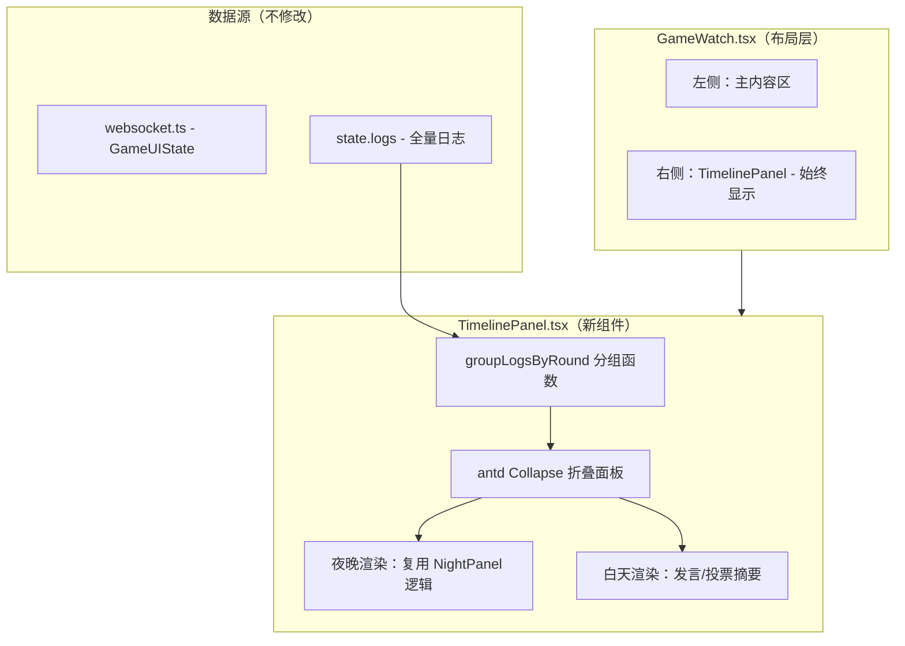
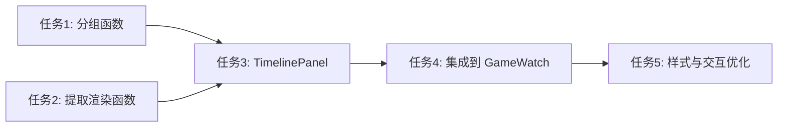

# GameWatch 右侧时间线面板改造 实施计划

> 创建时间：2026-02-21
> automation_mode：false

---

## 1. 概述

### 1.1 项目目标
将 GameWatch 观看页右侧的 NightPanel（仅夜晚显示）改造为始终存在的、按天分组、可折叠的时间线面板，提升游戏回看体验。

### 1.2 背景
当前右侧 NightPanel 仅在 `phase === "NIGHT_PHASE"` 时渲染，切换到白天或游戏结束后消失，导致历史夜晚信息丢失。左侧主内容区日志平铺，无按轮次分组，回看困难。

### 1.3 范围
- **在范围内 (In-Scope)**：
  - 新建 TimelinePanel 组件替代 NightPanel
  - 实现日志按轮次（夜晚+白天）分组
  - 右侧面板始终显示，支持折叠/展开
  - 游戏结束后保留完整时间线
- **不在范围内 (Out-of-Scope)**：
  - WebSocket 状态管理层重构
  - 左侧主内容区的分组改造
  - 移动端适配
  - 后端 API 变更

---

## 2. 需求分析

### 2.1 功能需求
| ID | 需求描述 | 优先级 | 备注 |
|----|---------|--------|------|
| FR-001 | 右侧面板始终显示，不随阶段切换消失 | P0 | 移除条件渲染 |
| FR-002 | 日志按轮次分组（第N夜 + 第N天） | P0 | 基于 phase_change 事件分组 |
| FR-003 | 每轮可折叠/展开，当前轮默认展开 | P0 | 使用 antd Collapse |
| FR-004 | 夜晚部分保留频道 Tab 展示（狼人/女巫/预言家等） | P1 | 复用 NightPanel 渲染逻辑 |
| FR-005 | 白天部分展示发言、投票等关键事件摘要 | P1 | 精简展示 |
| FR-006 | 游戏结束后完整时间线可回看 | P0 | |

### 2.2 非功能需求
| ID | 需求描述 | 指标 | 备注 |
|----|---------|------|------|
| NFR-001 | 分组计算性能 | useMemo 优化，无感知延迟 | logs 数量通常 <500 |
| NFR-002 | 组件渲染流畅 | 折叠/展开无卡顿 | |

---

## 3. 技术方案

### 3.1 技术选型
| 层级 | 技术/框架 | 版本 | 理由 |
|------|-----------|------|------|
| 前端框架 | React | 19 | 现有技术栈 |
| UI 组件 | Ant Design (antd) | 6 | 现有技术栈，Collapse 组件 |
| 构建工具 | Vite | - | 现有技术栈 |
| 语言 | TypeScript | - | 现有技术栈 |

### 3.2 架构设计



### 3.3 关键设计决策
| 决策点 | 选择 | 理由 | 备选方案 |
|--------|------|------|----------|
| 数据来源 | 从 logs 中提取分组 | 不改 websocket.ts，降低风险 | 修改 nightActions 为按轮累积 |
| 分组方式 | 按 phase_change 事件切分 | logs 已含完整事件流 | 按 round 字段直接分组 |
| 折叠组件 | antd Collapse | 项目已用 antd，风格统一 | 自定义折叠组件 |
| NightPanel 处理 | 提取渲染函数复用，保留文件 | 渐进式改造，可回退 | 直接删除 NightPanel |

---

## 4. 任务分解

### 4.1 任务列表

> 执行时逐项勾选，完成后添加简要说明

- [x] **任务 1**: 创建 `groupLogsByRound` 分组工具函数
  - 预估工时：1 小时
  - 相关文件：`frontend/src/utils/logGrouper.ts`（新建）
  - 说明：遍历 logs，按 phase_change 事件将日志切分为 `RoundGroup[]`，每组含 round、nightLogs、dayLogs。导出 `RoundGroup` 类型定义。

- [x] **任务 2**: 从 NightPanel 提取可复用的夜晚行动渲染函数
  - 预估工时：0.5 小时
  - 相关文件：`frontend/src/components/NightPanel.tsx`
  - 说明：将 `renderAction`、`renderAiNotes`、`CHANNELS` 配置导出为独立函数/常量，供 TimelinePanel 复用。NightPanel 组件本身保留但不再被 GameWatch 直接使用。

- [x] **任务 3**: 创建 TimelinePanel 组件
  - 预估工时：2 小时
  - 相关文件：`frontend/src/components/TimelinePanel.tsx`（新建）
  - 依赖：任务 1、任务 2
  - 说明：
    - 接收 props：`logs`, `players`, `thinkingPlayers`, `currentRound`, `currentPhase`, `sheriff`
    - 使用 `useMemo` + `groupLogsByRound` 计算分组
    - 使用 antd `Collapse` 渲染每轮，当前轮默认展开
    - 夜晚部分：调用 NightPanel 导出的渲染函数，按频道 Tab 展示
    - 白天部分：精简展示发言数量、投票结果、死亡信息等摘要
    - 游戏未开始时显示占位提示

- [x] **任务 4**: 修改 GameWatch.tsx 布局，集成 TimelinePanel
  - 预估工时：1 小时
  - 相关文件：`frontend/src/pages/GameWatch.tsx`
  - 依赖：任务 3
  - 说明：
    - 移除 `state.phase === "NIGHT_PHASE"` 条件渲染
    - 替换 NightPanel 为 TimelinePanel，传递所需 props
    - 右侧面板始终渲染，调整左右宽度比例（flex: 3 / flex: 2）
    - 移除 NightPanel 的 import

- [x] **任务 5**: 样式微调与交互优化
  - 预估工时：0.5 小时
  - 相关文件：`frontend/src/components/TimelinePanel.tsx`
  - 依赖：任务 4
  - 说明：
    - 确保 Collapse 内嵌 Tabs 样式正常
    - 当前轮高亮标识
    - 新轮次出现时自动滚动到最新面板
    - 空状态（游戏开始前）友好提示

- [x] **任务 6**: 修复 ThinkingIndicator phase 映射缺失
  - 预估工时：5 分钟
  - 相关文件：`frontend/src/components/ThinkingIndicator.tsx`
  - 依赖：无（可独立执行）
  - 说明：`PHASE_NAMES` 映射表缺少 3 个警长相关 phase，导致显示原始英文字段名。补充：
    - `sheriff_register` → "上警决定"
    - `sheriff_speech` → "竞选演说"
    - `sheriff_vote` → "警长投票"

- [x] **任务 7**: 修复 AI 玩家不知道谁是警长的问题
  - 预估工时：1 小时
  - 相关文件：
    - `backend/ai/agent.py` — `_build_context` 方法
    - `backend/ai/prompts.py` — 各阶段 prompt 模板
    - `backend/game/engine.py` — 警长竞选后写入记忆
    - `backend/systems/sheriff.py` — 警徽流转后写入记忆
    - `backend/ai/memory.py` — `add_public_event`
  - 依赖：无（可独立执行）
  - 说明：当前 AI 完全不知道谁是警长，导致出现"3号是警长但别人觉得警徽在7号"的幻觉。需修复两处：
    1. **`_build_context` 补充警长信息**：在上下文变量中加入 `sheriff_id`（当前警长编号或"无"），并在关键 prompt 模板（发言、投票等）中引用 `{sheriff}` 变量
    2. **警长相关事件写入公开记忆**：在以下节点调用 `memory.add_public_event()`：
       - 警长竞选结束后（"X号当选警长"）
       - 警徽传承后（"警长X号将警徽传给Y号"）
       - 警徽撕毁后（"警长X号撕毁警徽"）
       - 无人当选时（"本局无警长"）

- [x] **任务 8**: 【严重】修复预言家白天发言/投票时不知道自己查验结果的 bug
  - 预估工时：30 分钟
  - 相关文件：
    - `backend/ai/prompts.py` — `DAY_SPEECH_PROMPT`、`VOTE_PROMPT`、`LAST_WORDS_PROMPT`
  - 依赖：无（可独立执行，优先级最高）
  - 说明：`{private_knowledge}` 变量只出现在预言家夜晚行动 prompt 中（第74行），白天发言（`DAY_SPEECH_PROMPT`）、投票（`VOTE_PROMPT`）、遗言（`LAST_WORDS_PROMPT`）的模板里都没有引用 `{private_knowledge}`。导致：
    - 预言家白天发言时看不到自己的查验结果，只能靠 ai_notes 里的策略笔记"回忆"
    - AI 会根据自己的怀疑编造查验结果（如实际查到"好人"却报"查杀"）
    - 同理，女巫、守卫等角色的私有知识（用药记录、守护记录）在白天也不可见
    - 修复方案：在 `DAY_SPEECH_PROMPT`、`VOTE_PROMPT`、`LAST_WORDS_PROMPT` 中加入 `{private_knowledge}` 区块（如"【你的私有信息】\n{private_knowledge}"），确保所有角色在白天决策时能看到自己的关键信息

- [x] **任务 9**: 修复 AI 对已死亡/被放逐玩家的感知不足
  - 预估工时：30 分钟
  - 相关文件：
    - `backend/ai/agent.py` — `_build_context` 方法
    - `backend/ai/prompts.py` — `DAY_SPEECH_PROMPT`、`VOTE_PROMPT`
    - `backend/game/engine.py` — `_discussion` 和 `_get_ai_speech` 调用
  - 依赖：无（可独立执行）
  - 说明：AI 在白天发言时仍然讨论已死亡/被放逐的玩家（如3号已被放逐，但其他玩家还在说"投3号"）。原因：
    1. `_build_context` 只提供了 `alive_players` 列表，但没有明确列出"已死亡/被放逐的玩家及原因"
    2. `death_announcement` 参数在 `engine.py` 调用 `day_speech` 时未传递（使用默认空字符串）
    3. `memory_summary` 中的 `ai_notes` 和 `speeches` 保留了上一轮关于已死亡玩家的大量讨论，AI 容易被误导
    - 修复方案：
      1. 在 `_build_context` 中加入 `dead_players` 信息（"已出局玩家：3号(被放逐)、4号(被放逐)、11号(被放逐)"）
      2. 在 `DAY_SPEECH_PROMPT` 和 `VOTE_PROMPT` 中加入明确提示："以下玩家已出局，不要对已出局玩家进行投票或讨论投票目标：{dead_players}"
      3. `engine.py` 调用 `day_speech` 时传入当天的死亡公告

- [x] **任务 10**: 修复猎人遗言与开枪目标不一致的问题
  - 预估工时：30 分钟
  - 相关文件：
    - `backend/game/engine.py` — `_last_words` 和 `_hunter_shoot` 调用链
    - `backend/ai/agent.py` — `hunter_shoot` 方法
    - `backend/ai/prompts.py` — `HUNTER_SHOOT_PROMPT`
  - 依赖：无（可独立执行）
  - 说明：猎人遗言和开枪是两次独立的 LLM 调用，遗言里说"带走7号"但实际开枪打了8号。原因：
    1. 遗言内容不会传递给开枪 prompt，两次 AI 调用完全独立
    2. 开枪 prompt 里没有 `{private_knowledge}`，也没有"你刚才遗言说了什么"的上下文
    3. 两次调用可能产生不同的判断
    - 修复方案：将遗言内容作为上下文传递给猎人开枪决策。在 `engine.py` 中，`_last_words` 返回遗言内容，传给 `_hunter_shoot`；在 `HUNTER_SHOOT_PROMPT` 中加入"你刚才的遗言：{last_words_content}"，并强调"请与你的遗言保持一致"

- [x] **任务 11**: 修复狼人讨论时对已死亡队友的错误认知
  - 预估工时：20 分钟
  - 相关文件：
    - `backend/ai/agent.py` — `_build_context` 方法
    - `backend/ai/prompts.py` — 狼人夜晚行动 prompt
  - 依赖：任务 9（共享 dead_players 上下文方案）
  - 说明：狼人讨论时，虽然 `wolf_teammates` 列表正确（只含存活狼人），但 AI 仍然认为已死亡的队友还在。如截图中 9号说"我们三狼(2/9/12)"，但 12号已被放逐。原因：
    1. prompt 只给了存活队友列表，没有明确说"以下队友已出局"
    2. `memory_summary` 和 `ai_notes` 中保留了大量关于已死亡队友的历史信息，AI 被旧记忆误导
    3. 同样，9号说"昨天成功推掉了5号"但5号实际还活着，说明 AI 对出局信息的感知全面缺失
    - 修复方案（与任务 9 统一）：
      1. 在狼人 prompt 中加入"已出局的狼人队友：{dead_wolves}"
      2. 在 `_build_context` 中为狼人角色额外构建 `dead_wolves` 信息
      3. 强调"只有 {wolf_teammates} 是你当前的存活队友，其他狼人已出局"

- [x] **任务 12**: 修复狼人投票时不知道队友身份、无法协同投票的问题
  - 预估工时：30 分钟
  - 相关文件：
    - `backend/ai/prompts.py` — `VOTE_PROMPT` 模板
    - `backend/ai/agent.py` — `_build_context` 和 `vote_decision` 方法
  - 依赖：任务 9（共享 dead_players 上下文方案）
  - 说明：在 2v2 局面（2号狼人、9号狼人 vs 5号守卫、6号村民）中，9号狼人投了自己的队友2号，导致狼人阵营在必胜局面下失败。原因：
    1. `_build_context` 为狼人角色构建了 `wolf_teammates` 上下文变量（agent.py 第172行），但 `VOTE_PROMPT` 模板中**没有** `{wolf_teammates}` 占位符
    2. `SafeDict` 静默丢弃未引用的变量，导致狼人投票时完全不知道谁是队友
    3. 投票 prompt 中没有任何狼人阵营的战术指导（如"绝对不要投票给自己的队友"）
    4. 缺少残局意识——2v2 时狼人只需统一投票即可获胜，但 AI 无此认知
    - 修复方案：
      1. 在 `VOTE_PROMPT` 中为狼人角色加入 `{wolf_teammates}` 区块（如"【你的狼人队友】\n你的存活队友：{wolf_teammates}\n⚠️ 绝对不要投票给自己的队友！"）
      2. 加入狼人投票策略提示："作为狼人，你必须与队友统一投票目标，集中票数投给同一个好人"
      3. 加入残局意识提示："当前存活人数较少时，狼人阵营更需要精准配合，确保每一票都投给好人阵营"
      4. 在 `_build_context` 中确保 `wolf_teammates` 在投票阶段也被正确传递（当前仅在夜晚行动时传递）

- [x] **任务 13**: 修复 ThinkingIndicator 转圈圈不消失的问题
  - 预估工时：30 分钟
  - 相关文件：
    - `frontend/src/services/websocket.ts` — `thinkingPlayers` 状态管理
  - 依赖：无（可独立执行）
  - 说明：`thinkingPlayers` 数组在收到 `game.ai_thinking` 事件时添加玩家 ID，但只在以下事件中移除：
    - `game.phase_change` → 清空全部
    - `game.night_action` → 移除对应 player_id
    - `game.speech` → 移除对应 player_id
    - `game.vote_cast` → 移除对应 voter_id

    以下场景缺少移除逻辑，导致转圈圈永远不消失：
    1. **警长竞选**：`game.sheriff_election`（register_decision / vote_cast）不清除 thinkingPlayers
    2. **猎人开枪**：`game.death` 事件不清除 thinkingPlayers
    3. **狼人讨论**：`game.wolf_discussion` 事件不清除 thinkingPlayers
    - 修复方案：
      1. 在 `game.sheriff_election` 处理中，当 `phase === "register_decision"` 时移除对应 `player_id`，当 `phase === "vote_cast"` 时移除对应 `voter_id`
      2. 在 `game.wolf_discussion` 处理中移除对应 `wolf_id`
      3. 在 `game.death` 处理中移除对应 `player_id`（猎人开枪后死亡）
      4. 增加兜底机制：设置超时（如 30 秒），超时后自动从 thinkingPlayers 中移除，防止极端情况下永远转圈

- [x] **任务 14**: 优化自动滚动行为，避免打断用户回看历史内容
  - 预估工时：20 分钟
  - 相关文件：
    - `frontend/src/pages/GameWatch.tsx` — `useEffect` 自动滚动逻辑（第61-63行）
  - 依赖：无（可独立执行）
  - 说明：当前 GameWatch 的自动滚动逻辑为：
    ```typescript
    useEffect(() => {
      logEndRef.current?.scrollIntoView({ behavior: "smooth" });
    }, [state.logs.length]);
    ```
    每次有新日志就强制滚动到底部，如果用户正在翻看上方的历史内容会被强制拉回底部，体验很差。
    - 修复方案：
      1. 添加"是否在底部附近"的检测逻辑：记录滚动容器的 `scrollTop + clientHeight` 与 `scrollHeight` 的差值
      2. 只有当用户已经在底部附近（如距底部 < 100px）时才自动滚动
      3. 可选：在非底部时显示一个"有新消息 ↓"的浮动按钮，点击后滚动到底部

- [x] **任务 15**: 修复警长相关 prompt 缺少关键上下文（player_id / private_knowledge / alive_players）
  - 预估工时：30 分钟
  - 相关文件：
    - `backend/ai/prompts.py` — 所有 `SHERIFF_*_PROMPT` 模板
  - 依赖：任务 8（共享 private_knowledge 方案）
  - 说明：警长竞选/演说/投票/传承/调序的 prompt 模板存在多处信息缺失：
    1. **`SHERIFF_SPEECH_PROMPT`** 缺少 `{player_id}`、`{alive_players}`、`{private_knowledge}` — AI 竞选演说时不知道自己是几号，看不到存活玩家列表，预言家看不到查验结果
    2. **`SHERIFF_VOTE_PROMPT`** 缺少 `{player_id}`、`{alive_players}`、`{private_knowledge}` — AI 投票时不知道自己是几号
    3. **`SHERIFF_BADGE_TRANSFER_PROMPT`** 缺少 `{player_id}`、`{private_knowledge}` — 警长传承时不知道自己是几号
    4. **`SHERIFF_ADJUST_ORDER_PROMPT`** 缺少 `{ai_notes}` — 警长调序时看不到自己的思考笔记
    - 修复方案：在上述模板中补充缺失的变量占位符。`_build_context` 已经构建了这些变量，只是模板没有引用，被 `SafeDict` 静默丢弃了

- [x] **任务 16**: 增强投票记忆，记录完整投票详情供 AI 分析投票模式
  - 预估工时：30 分钟
  - 相关文件：
    - `backend/ai/memory.py` — `record_vote` 方法和 `to_summary` 方法
    - `backend/game/engine.py` — `_vote` 方法中的记忆写入
  - 依赖：无（可独立执行）
  - 说明：当前投票记忆只记录"我投了X号"和投票结果统计，但不包含：
    1. **其他玩家的投票详情**（谁投了谁）— AI 无法分析投票模式（如"5号和7号总是投同一个人，可能是同阵营"）
    2. **投票结果**（谁被放逐）— `to_summary()` 中投票记录只显示"我投了X号"，不显示最终结果
    3. **投票轮次的完整信息** — 无法回顾历史投票做跨轮分析
    - 修复方案：
      1. 在 `_vote` 中将完整投票映射（votes dict）写入公开事件记忆（如"第N轮投票：2号→5号, 3号→5号, 5号→2号..."）
      2. 在 `to_summary()` 中增加投票结果展示（"第N轮投票结果：X号被放逐（得Y票）"）
      3. 可选：在 `record_vote` 中增加 `all_votes` 字段保存完整投票映射

- [x] **任务 17**: 遗言 prompt 补充 {alive_players}，让临死玩家能给出有针对性的遗言
  - 预估工时：5 分钟
  - 相关文件：
    - `backend/ai/prompts.py` — `LAST_WORDS_PROMPT`
  - 依赖：无（可独立执行）
  - 说明：`LAST_WORDS_PROMPT` 没有 `{alive_players}` 变量，临死的玩家不知道谁还活着，无法给出有针对性的遗言（如预言家临死前应该报出查验结果并指出谁可疑，但不知道谁还活着就无法有效传递信息）。
    - 修复方案：在 `LAST_WORDS_PROMPT` 中加入 `{alive_players}`（如"【当前存活玩家】{alive_players}"）

- [x] **任务 18**: 白天发言 prompt 为狼人补充 {wolf_teammates}，防止暴露队友
  - 预估工时：10 分钟
  - 相关文件：
    - `backend/ai/prompts.py` — `DAY_SPEECH_PROMPT`
    - `backend/ai/agent.py` — `day_speech` 方法
  - 依赖：任务 12（共享 wolf_teammates 方案）
  - 说明：狼人白天发言时不知道队友是谁（`DAY_SPEECH_PROMPT` 没有 `{wolf_teammates}`），可能在发言中不小心暴露队友（如攻击自己的队友、或者明显袒护队友）。
    - 修复方案：
      1. 在 `DAY_SPEECH_PROMPT` 中为狼人加入条件性的 `{wolf_teammates}` 区块
      2. 加入提示："你的狼人队友是 {wolf_teammates}，发言时注意不要暴露队友身份，也不要攻击自己的队友"
      3. 由于 `_build_context` 已经为狼人构建了 `wolf_teammates`，只需在模板中引用即可

- [x] **任务 19**: 【严重】修复遗言内容不广播到其他 AI 记忆的问题
  - 预估工时：20 分钟
  - 相关文件：
    - `backend/ai/agent.py` — `last_words` 方法
    - `backend/game/engine.py` — `_last_words` 方法
  - 依赖：无（可独立执行，优先级高）
  - 说明：当前遗言流程中，AI 生成遗言后只通过 WebSocket 推送给前端展示，**没有调用 `broadcast_speech` 写入其他存活玩家的记忆**。对比白天发言（`day_speech`）会调用 `self.memory.broadcast_speech()` 广播到所有存活玩家。导致：
    1. 预言家临死前报出查验结果（如"我查了3号是狼人"），但其他 AI 玩家的记忆中完全没有这段遗言，下一轮发言和投票时无法利用这个关键信息
    2. 猎人遗言说"我要带走7号"，但其他人不知道
    3. 任何角色的遗言揭示的信息（如女巫报用药情况、守卫报守护记录）都无法被其他 AI 感知
    - 修复方案：在 `agent.last_words()` 返回遗言内容后，调用 `self.memory.broadcast_speech(player_id, speech, self.state.current_round)` 将遗言广播到所有存活玩家的记忆中。或者在 `engine._last_words()` 中拿到遗言后调用广播

- [x] **任务 20**: 【严重】修复 ai_notes 每轮被覆盖、前几天思考全部丢失的问题
  - 预估工时：40 分钟
  - 相关文件：
    - `backend/ai/memory.py` — `update_ai_output` 方法、`PlayerMemory.ai_notes` 字段
    - `backend/ai/agent.py` — 所有调用 `update_ai_output` 的地方
    - `backend/ai/agent.py` — `_format_ai_notes` 函数
  - 依赖：无（可独立执行，优先级高）
  - 说明：`ai_notes` 是 `dict[str, str]` 类型，`update_ai_output` 使用 `dict.update()` 覆盖同 key。导致：
    - `night_strategy` 每夜覆盖 → 第2夜覆盖第1夜的思考
    - `day_analysis` 每天覆盖 → 第2天覆盖第1天的分析
    - `vote_reasoning` 每天覆盖 → 第2天覆盖第1天的投票理由
    - 到第3天时，AI 完全不记得第1天自己怎么分析的、怀疑过谁、为什么投某人
    - 这导致 AI 的推理缺乏连贯性，无法做跨轮次的逻辑推演（如"我第1天就怀疑5号，现在更加确定了"）
    - 修复方案：
      1. 将 `ai_notes` 改为按轮次存储，如 `dict[str, list]` 或 `list[dict]`，每轮追加而非覆盖
      2. 例如 key 改为 `"round_1_night_strategy"`、`"round_1_day_analysis"` 等，或改为 `[{"round": 1, "phase": "night", "notes": "..."}]`
      3. `_format_ai_notes` 相应调整，展示最近 2-3 轮的笔记（避免 prompt 过长）
      4. 保留最新轮次的完整笔记 + 历史轮次的摘要

- [x] **任务 21**: 【严重】修复 memory.to_summary() 只显示当前轮发言、历史发言全部丢失的问题
  - 预估工时：30 分钟
  - 相关文件：
    - `backend/ai/memory.py` — `to_summary` 方法（第52-62行）
  - 依赖：无（可独立执行，优先级高）
  - 说明：`to_summary()` 中发言记录的逻辑为：
    ```python
    recent_speeches = [s for s in self.speeches if s.get("round") == self.current_round]
    if not recent_speeches:
        recent_speeches = self.speeches[-12:] if self.speeches else []
    ```
    只要当前轮有发言，就只显示当前轮的。第3天发言时，第1天谁跳了预言家、谁报了查验结果、谁互相对线——全部看不到。这对狼人杀推理极其致命，因为：
    - 无法追踪"昨天3号说自己是预言家查了5号是狼人"这种关键信息
    - 无法发现发言前后矛盾（如"昨天说查了5号好人，今天又说查了5号狼人"）
    - 无法做跨天的逻辑链推理
    - 修复方案：
      1. 改为显示最近 2-3 轮的发言记录（而非仅当前轮）
      2. 历史轮次可以做摘要压缩（如只保留每人发言的前50字）
      3. 当前轮保留完整发言
      4. 可选：对关键发言（跳身份、报查验、指认狼人）做标记，优先保留

- [x] **任务 22**: 修复竞选演说不广播到 AI 记忆的问题
  - 预估工时：10 分钟
  - 相关文件：
    - `backend/systems/sheriff.py` — `run_sheriff_election` 函数（第85-89行）
    - `backend/game/engine.py` — 需要传入 memory 引用或回调
  - 依赖：任务 19（共享广播方案）
  - 说明：与遗言（任务19）完全相同的问题——竞选演说只通过 `emit_event("game.speech")` 推送前端展示，没有调用 `broadcast_speech` 写入其他玩家记忆。导致：
    - 其他 AI 不知道竞选者说了什么
    - 投票时无法根据竞选演说内容做判断
    - 修复方案：在 `sheriff.py` 的竞选演说推送后，调用 `broadcast_speech` 将演说内容写入所有存活玩家的记忆

- [x] **任务 23**: 修复狼人讨论具体对话内容跨夜丢失的问题
  - 预估工时：20 分钟
  - 相关文件：
    - `backend/ai/agent.py` — `wolf_discussion` 方法、`_save_wolf_discussion_memory` 方法
    - `backend/ai/memory.py` — 可能需要新增狼人讨论记录字段
  - 依赖：无（可独立执行）
  - 说明：`wolf_discussion()` 中的 `discussion_log` 是局部变量，每夜重新创建。讨论结束后只通过 `_save_wolf_discussion_memory` 写了一句摘要到 `public_events`（如"第1夜狼人商量，最终决定刀5号"），具体谁说了什么、谁建议刀谁全部丢失。导致：
    - 第2夜讨论时，狼人不记得第1夜队友的策略偏好和讨论内容
    - 无法做跨夜的协同策略（如"上次你建议刀5号但被守了，这次换个目标"）
    - 修复方案：
      1. 在 `_save_wolf_discussion_memory` 中将讨论详情（每个狼人的发言和建议目标）写入狼人的 `public_events` 或新增专用字段
      2. 保留最近 1-2 夜的讨论详情，更早的只保留摘要（控制 prompt 长度）

- [x] **任务 24**: 修复部分重要法官叙述/游戏事件不写入 AI 记忆的问题
  - 预估工时：20 分钟
  - 相关文件：
    - `backend/game/engine.py` — `_hunter_shoot`、`_discussion`（自爆部分）、`_vote`（平票部分）
  - 依赖：无（可独立执行）
  - 说明：目前只有"昨晚死亡公告"（`_announce_deaths`）和"投票放逐"（`_vote`）调用了 `add_public_event`，以下重要事件没有写入 AI 记忆：
    1. **猎人开枪**："猎人X号带走了Y号" → AI 不知道某人是被猎人射杀的
    2. **狼人自爆**："X号玩家自爆" → AI 不知道有人自爆了（也不知道自爆者是狼人）
    3. **平票无人出局** → AI 不知道上轮投票是平票结局
    4. **警长调整发言顺序** → AI 不知道警长调整了顺序
    - 修复方案：在上述事件发生后，调用 `self.ai.memory.add_public_event()` 写入对应事件记录

- [x] **任务 25**: 【严重】修复狼人自爆后未检查胜利条件、多跑一个无意义夜晚的 bug
  - 预估工时：15 分钟
  - 相关文件：
    - `backend/game/engine.py` — `_run_day` 方法（第376-379行）
  - 依赖：无（可独立执行，优先级高）
  - 说明：当狼人自爆后，`_discussion()` 返回 `True`，`_run_day` 直接 `return` 跳过了后续的胜利检查（第382-385行）。如果最后一只狼自爆，游戏不会立即结束，而是：
    1. 进入下一个夜晚阶段
    2. 守卫、女巫、预言家全部白行动一轮（浪费药水/查验）
    3. 夜晚结算时 `resolve_night` → `check_victory` 才检测到好人胜利
    - 修复方案：在 `if wolf_exploded:` 分支中，`return` 之前加入胜利检查：
      ```python
      if wolf_exploded:
          winner = self.state.check_victory()
          if winner:
              self.state.winner = winner
          return
      ```

- [x] **任务 26**: 修复猎人连锁开枪未处理的问题（猎人射杀猎人时第二个猎人无法开枪）
  - 预估工时：30 分钟
  - 相关文件：
    - `backend/game/engine.py` — `_run_day` 方法中猎人开枪后的处理逻辑（第352-358行、第400-405行）
  - 依赖：无（可独立执行）
  - 说明：当猎人 A 被杀后开枪射杀猎人 B 时，当前代码只对猎人 B 处理了警长死亡（`_handle_death_sheriff`），但没有递归检查猎人 B 是否也应该触发开枪。在标准狼人杀规则中，被猎人射杀的猎人也可以开枪（连锁反应）。
    - 修复方案：将猎人射杀后的处理改为递归或循环结构：
      1. 猎人 A 开枪射杀目标 X
      2. 检查 X 是否是猎人且可以开枪 → 如果是，X 也开枪
      3. 重复直到射杀目标不是猎人或无法开枪
      4. 加入防无限循环保护（最多递归 2 层，因为最多 1 个猎人，但防御性编程）
      5. 每次射杀后都检查胜利条件

- [x] **任务 27**: 修复 AI 投票 fallback（第4层兜底）可能让狼人投给队友的问题
  - 预估工时：10 分钟
  - 相关文件：
    - `backend/ai/agent.py` — `vote_decision` 方法（第328行）
  - 依赖：任务 12（共享 wolf_teammates 方案）
  - 说明：当 LLM 完全失败降级到第4层随机兜底时，`vote_decision` 的 `valid_targets` 是 `[p for p in alive if p != player_id]`，不排除狼人队友。虽然 Task 12 从 prompt 层面解决了正常情况，但 fallback 随机选择仍可能选中队友。
    - 修复方案：在 `vote_decision` 中，如果玩家是狼人，将 `targets` 改为排除狼人队友：
      ```python
      if player.role == RoleType.WEREWOLF:
          wolf_ids = self.state.get_alive_wolf_ids()
          targets = [p for p in alive if p != player_id and p not in wolf_ids]
      ```

- [x] **任务 28**: 修复 NightPanel 不受 showThinking 开关控制的问题
  - 预估工时：10 分钟
  - 相关文件：
    - `frontend/src/components/NightPanel.tsx` — `renderAiNotes` 函数
    - `frontend/src/pages/GameWatch.tsx` — NightPanel 调用处
  - 依赖：无（可独立执行）
  - 说明：ChatBubble 和 ThinkingIndicator 都正确检查了 `showThinking` 开关，但 NightPanel 的 `renderAiNotes` 函数始终渲染 AI 思考笔记（🧠），不接收也不检查 `showThinking` prop。关闭"思考过程"开关后，夜晚面板的 AI 笔记仍然可见。
    - 修复方案：
      1. NightPanel 新增 `showThinking` prop
      2. `renderAiNotes` 在 `showThinking === false` 时返回 null
      3. GameWatch 传递 `showThinking` 给 NightPanel

- [x] **任务 29**: 优化狼人夜晚讨论的互动感，避免发言高度雷同
  - 预估工时：30 分钟
  - 相关文件：
    - `backend/ai/prompts.py` — 狼人夜晚行动 prompt 模板（werewolf）
    - `backend/ai/agent.py` — `wolf_discussion` 方法中构建 `disc_text` 的逻辑
  - 依赖：无（可独立执行）
  - 说明：当前狼人讨论虽然代码层面会把前一位狼人的发言注入到下一位的 prompt 中（`discussion_log`），但实际效果是三只狼的发言高度雷同——几乎是复制粘贴级别的相似分析。原因：
    1. prompt 模板中没有强调"你需要基于队友已有的发言来回应、补充或调整观点"
    2. 没有引导差异化发言（如"不要重复队友已经说过的分析"）
    3. 缺少对话感的引导（如"回应队友的建议，表达你的看法"）
    - 修复方案：
      1. 在 prompt 中加入明确指令："请仔细阅读队友的发言，基于他们的观点进行回应和补充，而不是独立重复相同的分析"
      2. 加入差异化引导："如果你同意队友的目标，简短表态并补充新的理由；如果你有不同意见，说明你的理由"
      3. 限制发言长度，鼓励简洁有力的对话式回应而非长篇独白

- [x] **任务 30**: kimi-k2.5 模型 temperature 兼容
  - 预估工时：15 分钟
  - 相关文件：
    - `backend/ai/llm_client.py` — `chat()` 方法的 temperature 参数处理
  - 说明：kimi-k2.5 要求 temperature 必须为 1，当前代码写死 0.7 导致 400 错误。需要支持按模型/配置自定义 temperature，或在 400 时自动去掉 temperature 重试。

- [x] **任务 31**: 夜晚行动 prompt 缺少玩家编号提醒，导致预言家查验自己
  - 预估工时：10 分钟
  - 相关文件：
    - `backend/ai/prompts.py` — 各角色夜晚行动 prompt 模板（seer/guard/witch）
  - 说明：系统 prompt 中有"你是X号玩家"，但夜晚行动 prompt 没有重复强调，LLM 在长上下文中可能遗忘。需要在每个夜晚行动 prompt 开头加上"你是{player_id}号玩家"的提醒，并明确"不要对自己使用技能"。

- [ ] **任务 32**: 白天发言两阶段 LLM 调用改造（先思考后发言）
  - 优先级：P1
  - 涉及文件：`backend/ai/prompts.py`, `backend/ai/agent.py`
  - 背景：当前 `day_speech` 一次性要求 LLM 同时输出 `ai_notes`（内心思考）和 `speech`（公开发言），导致模型容易自相矛盾（如猎人 ai_notes 说"不暴露身份"，speech 却直接说"我是猎人"）
  - 方案：拆分为两次 LLM 调用，每次专注做一件事（经 DeepSeek 深度分析确认可行）
  - 数据流设计：
    ```
    第1阶段（思考）：全部信息 → 输出结构化策略 JSON
    第2阶段（发言）：全部信息 + 策略摘要 → 输出 speech（+ explode）
    ```
  - 子任务：
    - [x] 32.1 在 `prompts.py` 中新增两个模板（保留原 `DAY_SPEECH_PROMPT` 作为降级回退）
      - `DAY_THINK_PROMPT`：思考阶段模板
        - 输入：全部信息（round, player_id, alive/dead_players, sheriff, death_announcement, memory_summary, private_knowledge, ai_notes, extra_context, wolf_context, role_name）+ role_specific_guidance（角色专属策略引导）
        - 输出：结构化 JSON —— `situation_analysis`（局势分析）, `overall_strategy`（核心策略）, `talking_points`（发言要点列表）, `must_conceal`（绝对保密信息列表）, `can_reveal`（可选透露信息列表）
        - 角色差异化引导（通过 `role_specific_guidance` 字段）：
          - 猎人："避免暴露猎人身份，除非到了必须自证的生死关头"
          - 狼人："伪装好人，避免行为矛盾" + 自爆可能性评估
          - 预言家："策略性释放查验信息，避免被狼人针对"
          - 村民/守卫/女巫：通用策略引导
      - `DAY_SPEAK_PROMPT`：发言阶段模板
        - 输入：全部信息 + `strategy_summary`（第1阶段的策略摘要，压缩版）
        - 输出：`{{"speech": "...", "explode": false}}`
        - 约束方式（清单式，不仅靠文字提醒）：
          1. 必须覆盖 `talking_points` 中的要点
          2. 绝不能泄露 `must_conceal` 中的任何信息
          3. 可选使用 `can_reveal` 中的信息
          4. 发言风格需自然，像真人玩家
    - [x] 32.2 在 `prompts.py` 的 `build_phase_prompt` 中新增 `day_think` 和 `day_speak` 两个 phase 分支
    - [x] 32.3 改造 `agent.py` 的 `day_speech` 方法为两次调用
      - 新增 `_synthesize_strategy()` 方法：将思考 JSON 压缩为策略摘要文本（控制 context 长度）
      - 第1次调用：system prompt + `DAY_THINK_PROMPT` → 解析结构化策略
        - `max_tokens=500`（控制思考输出长度，避免 context 溢出）
      - 第2次调用：system prompt + `DAY_SPEAK_PROMPT`（注入策略摘要）→ 解析 speech + explode
      - 降级处理：
        - 第1次 parse_level > 2（严重失败）→ 回退到原 `DAY_SPEECH_PROMPT` 一次性方案
        - 第1次成功但第2次失败 → 从思考结果生成简易发言
      - 记忆保存：保存完整思考结果 + 策略摘要 + 实际发言
    - [x] 32.4 前端 WebSocket 适配（无需改动，engine.py 发送的 phase 仍为 "discussion"）
      - 检查前端是否依赖 `ai_thinking` 事件中的 phase 名称，确保 `day_speech` 阶段的思考指示器正常工作
    - [ ] 32.5 实际游戏测试验证
      - 重点验证：猎人是否不再自相矛盾暴露身份、狼人伪装是否与策略一致、发言质量是否提升

- [x] **任务 33**: 用户登录注册认证系统
  - 优先级：P1
  - 涉及文件：后端 + 前端多文件新增/修改
  - 背景：当前项目无用户系统，所有 API 无认证保护。需要添加基础的用户注册、登录、JWT 认证功能。不需要角色权限管理。
  - 参考：`/mnt/d/All_Project/发票系统/frontend` 的登录注册流程（Vue → 改写为 React + Ant Design）
  - 子任务：
    - [x] 33.1 后端：新建用户模型 `models/user.py`
      - `users` 表：id, username, password_hash, created_at, updated_at
      - 密码使用 bcrypt 哈希存储（`passlib` 库）
      - 在 `database.py` 的 `init_db()` 中注册新模型
    - [x] 33.2 后端：新建认证工具 `auth/utils.py`
      - JWT Token 生成与验证（`python-jose` 库）
      - 密码哈希与校验函数
      - `get_current_user` 依赖注入函数（从 Authorization header 解析 token → 返回用户）
      - JWT 密钥和过期时间配置加入 `config.py`（`WEREWOLF_JWT_SECRET`, `WEREWOLF_JWT_EXPIRE_HOURS`）
    - [x] 33.3 后端：新建认证路由 `api/auth.py`
      - `POST /api/auth/register` — 用户注册（用户名 + 密码）
      - `POST /api/auth/login` — 用户登录（返回 JWT token + 用户信息）
      - `GET /api/auth/profile` — 获取当前用户信息（需认证）
      - 在 `main.py` 中注册路由
    - [x] 33.4 后端：给现有 API 添加认证保护
      - LLM 配置接口（`api/llm_config.py`）：所有接口需要登录
      - 游戏接口（`api/game.py`）：创建/启动游戏需要登录
      - WebSocket（`api/websocket.py`）：暂不加认证（观战可公开）
      - 健康检查：不加认证
    - [x] 33.5 前端：新建认证相关 service `services/auth.ts`
      - Token 存储/读取/清除（localStorage，key: `werewolf_token`）
      - 用户信息存储/读取/清除（localStorage，key: `werewolf_user`）
      - 登录/注册/获取用户信息 API 调用
    - [x] 33.6 前端：修改 `services/api.ts` 添加认证 header
      - `request()` 函数自动从 localStorage 读取 token，添加 `Authorization: Bearer {token}` header
      - 401 响应时清除 token 并跳转登录页
    - [x] 33.7 前端：新建登录页面 `pages/Login.tsx`
      - 参照发票系统的玻璃态设计风格，适配 AI 狼人杀主题（暗色系）
      - 用户名 + 密码输入，Ant Design Form 组件
      - 登录成功后跳转首页 `/`
      - 底部"没有账号？立即注册"链接
    - [x] 33.8 前端：新建注册页面 `pages/Register.tsx`
      - 用户名 + 密码 + 确认密码
      - 密码一致性校验
      - 注册成功后跳转登录页
      - 底部"已有账号？去登录"链接
    - [x] 33.9 前端：修改路由配置 `App.tsx`
      - 新增 `/login` 和 `/register` 路由（独立布局，不带侧边栏）
      - 添加路由守卫组件 `ProtectedRoute`：未登录 → 跳转 `/login`
      - 已登录访问 `/login` → 跳转首页
      - MainLayout 内的路由用 `ProtectedRoute` 包裹
    - [x] 33.10 前端：MainLayout 添加用户信息展示和登出
      - 侧边栏底部或顶部显示当前用户名
      - 登出按钮，点击清除 token 并跳转登录页
    - [x] 33.11 安装依赖
      - 后端：`pip install passlib[bcrypt] python-jose[cryptography]`
      - 前端：无需额外依赖（使用现有 Ant Design）
    - [x] 33.12 测试验证
      - 注册新用户 → 登录 → 访问受保护页面 → 登出 → 验证跳转登录页
      - 未登录直接访问 `/game` 等页面 → 验证跳转登录页
      - 错误密码登录 → 验证错误提示

### 4.2 依赖关系



---

## 5. 里程碑

| 阶段 | 里程碑名称 | 完成标志 | 预计时间 |
|------|-----------|---------|---------|
| M1 | 数据与渲染基础 | 任务 1、2 完成，分组函数可用，渲染函数已导出 | 1.5 小时 |
| M2 | 核心组件完成 | 任务 3 完成，TimelinePanel 独立可渲染 | 2 小时 |
| M3 | 集成与优化 | 任务 4、5 完成，GameWatch 页面改造完毕 | 1.5 小时 |

---

## 6. 风险与约束

### 6.1 风险清单
| ID | 风险描述 | 可能性 | 影响 | 缓解措施 |
|----|---------|--------|------|----------|
| R-001 | logs 量大时分组计算性能下降 | 低 | 中 | useMemo 按 logs.length 缓存 |
| R-002 | Collapse 嵌套 Tabs 样式冲突 | 中 | 低 | 自定义 CSS 覆盖 |
| R-003 | 白天日志摘要信息不够直观 | 中 | 低 | 迭代优化展示格式 |

### 6.2 约束条件
- **技术约束**：不修改 websocket.ts 状态管理逻辑，仅在组件层做数据提取
- **兼容约束**：保留 NightPanel.tsx 文件，不删除（可回退）

---

## 7. 验收标准

### 7.1 验收清单
- [ ] 右侧面板在所有阶段（游戏开始、夜晚、白天、游戏结束）均可见
- [ ] 日志按轮次正确分组（第1夜+第1天、第2夜+第2天...）
- [ ] 当前轮默认展开，历史轮可折叠/展开
- [ ] 夜晚部分保留频道 Tab 展示（守卫/狼人/女巫/预言家/结算）
- [ ] 白天部分展示关键事件摘要
- [ ] 游戏结束后完整时间线可回看
- [ ] 无 TypeScript 编译错误
- [ ] 页面渲染流畅，无明显卡顿

---

## 8. 评审记录

### 8.1 变更记录
| 日期 | 变更内容 | 原因 | 影响 |
|------|---------|------|------|

### 8.2 执行摘要
[执行完成后补充]
